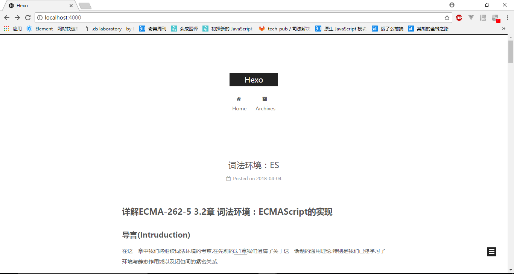

title: hexo 多人博客使用指南
date: 2018/4/4
categories:
- hexo
---
本篇指南意在指导本团队开发者使用由hexo搭建的多人博客

面向阅读对象：专业开发者

1. [github与ssh](#github_ssh)
2. [基本环境搭建](#base)
3. [如何写博客](#write)
4. [如何上传文章或博客系统修改](#upload)
5. [对博客系统进行修改(未完待续)](#modifiy)

<!--more-->
## (1)github与ssh

* 先将ssh添加到github上避免每次上传文章时都要输入账号密码

## (2)基本环境搭建

* git clone git@github.com:FE-Home/FE-Home.github.io.git localFileName (将源代码下载本地)

* git checkout -b hexo origin/hexo (将分支切换到hexo分支)

* cnpm i (下载js依赖包)

* git clone https://github.com/iissnan/hexo-theme-next themes/next (下载博客皮肤)

* hexo generate (生成静态文件)

* hexo server (运行本地服务，如果在http://localhost:4000/可以看到相应的网页，则说明基本环境搭建成功)

## (3)如何写博客

* 写博客主要在source的_posts下面利用markdown写相应的文章，具体语法可以参考[markdown语法](https://www.jianshu.com/p/b03a8d7b1719)

* hexo写博客可以参照 [hexo文档](https://hexo.io/zh-cn/docs/),这里面主要有三个命令[hexo generate](https://hexo.io/zh-cn/docs/generating.html)生成命令，[hexo server](https://hexo.io/zh-cn/docs/server.html)服务命令，[hexo deploy](https://hexo.io/zh-cn/docs/deployment.html)部署命令

## (4)如何上传文章或博客系统修改

* 记得每次上传前使用git pull(先将更新从远端拉取)

* hexo deploy (将静态文件提交到master)

* git add .   git commit -m '修改' git push origin hexo(将源文件同步到hexo分支:这里有点冗余最终可能会做成脚本命令)

* 最终在https://FE-Home.github.io/看到你的文章
